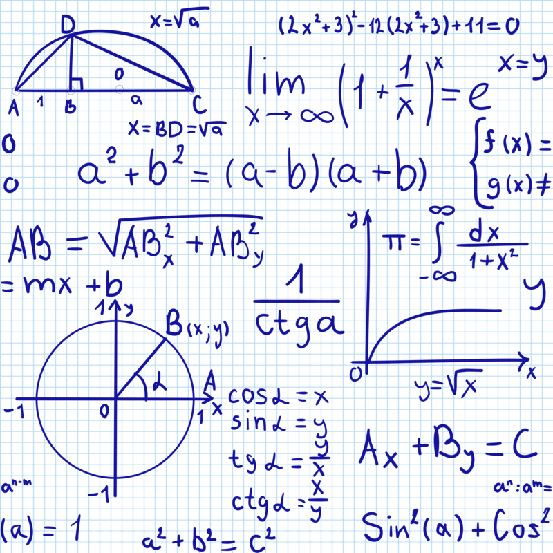

### Hi there 👋 Welcome to my profile

  

    ### Hi there 👋 Welcome to my profile
    #### I'm QA Automation engineer, actively increasing my skills in this direction. I have successful experience in relevant areas. I worked as an engineer of information transmission and distribution systems. I have experience in mobile development, programming controllers in assembly language, building IP and synchronous networks, and much, much more. I like electronics and technologies related to it.
    

  

    
    

Текст

Текст

#block1 {
float: left;
display: block;
width: 300px;
border: 1px solid blue;
margin: 2px;
}

#block2 {
float: left;
display: block;
width: 300px;
border: 1px solid blue;
margin: 2px;
}

<!--
### About me:
#### I'm QA Automation engineer, actively increasing my skills in this direction. I have successful experience in relevant areas. I worked as an engineer of information transmission and distribution systems. I have experience in mobile development, programming controllers in assembly language, building IP and synchronous networks, and much, much more. I like electronics and technologies related to it.
-->

### Languages and tools:

  
  
  
  
  
  
  
  
  
  
  
  
  
  
  
  
  
  

  <!--
  
  
  -->

### Activity on GitHub:

  

<!--
### Contacts:

**AleksandrButakov/AleksandrButakov** is a ✨ _special_ ✨ repository because its `README.md` (this file) appears on your GitHub profile.

Here are some ideas to get you started:
- 🔭 I’m currently working on ...
- 🌱 I’m currently learning ...
- 👯 I’m looking to collaborate on ...
- 🤔 I’m looking for help with ...
- 💬 Ask me about ...
- 📫 How to reach me: ...
- 😄 Pronouns: ...
- ⚡ Fun fact: ...
-->
